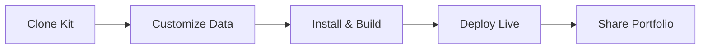

## Overview

Welcome to the Omkesh Narwade Portfolio Starter Kit. You get a modern, responsive website template that highlights your technical skills, education, certifications, and standout projects. Designed for Electronics and Computer Engineering students like those at MIT Aurangabad, it positions you as a top candidate for tech roles by showcasing expertise in programming, web technologies, cloud computing, and design tools.

This starter kit helps you build a professional online presence quickly. Customize sections for your resume, interactive project demos, and skill badges. Target audience includes engineering students, developers, and tech professionals seeking to impress recruiters with clean, visually appealing portfolios.

## Key Features

<Columns cols={3}>

<Card title="Skills Showcase" icon="star" href="#skills-section">

Display proficiency levels in languages like JavaScript, Python, React, and tools such as AWS, Docker, Figma. Use interactive progress bars and icons for visual impact.

</Card>

<Card title="Project Gallery" icon="code" href="#projects-section">

Feature live demos, GitHub links, and detailed case studies. Highlight challenges solved, technologies used, and results achieved in your engineering projects.

</Card>

<Card title="Education & Certifications" icon="book-open" href="#education-section">

List degrees from MIT Aurangabad, relevant coursework, and certifications like AWS Certified Developer or Google Cloud Associate.

</Card>

</Columns>

## Quick Start

Get your portfolio live in under 10 minutes. Follow these steps to clone, customize, and deploy.

<Steps>

<Step title="Clone Repository" icon="download">

Fork or clone the starter kit from GitHub.

<CodeGroup tabs="Git CLI,Download">

```bash
git clone https://github.com/yourusername/omkesh-portfolio-starter.git
cd omkesh-portfolio-starter
```

````bash
# Use GitHub CLI or download ZIP
gh repo clone yourusername/omkesh-portfolio-starter
````

</CodeGroup>

</Step>

<Step title="Install Dependencies" icon="package">

Install Node.js packages for the site.

<CodeGroup>

```bash
npm install
```

```bash
yarn install
```

</CodeGroup>

</Step>

<Step title="Customize Content" icon="edit-3">

Edit `data/profile.json` with your details.

````json
{
  "name": "Omkesh Narwade",
  "skills": [
    { "name": "React", "level": 90 },
    { "name": "Python", "level": 85 }
  ],
  "projects": [
    { "title": "IoT Dashboard", "link": "https://github.com/omkesh/iot-dashboard" }
  ]
}
````

</Step>

<Step title="Deploy" icon="rocket">

Build and deploy to Vercel or Netlify.

```bash
npm run build
# Deploy with: vercel deploy
```

</Step>

</Steps>

<Callout kind="tip">

Preview locally with `npm run dev` before deploying. Access at `http://localhost:3000`.

</Callout>

## Next Steps

Explore these guides to tailor your portfolio further.

<Columns cols={2}>

<Card title="Customize Skills" icon="settings" href="/customization">

Learn to add progress bars, animations, and custom icons for your tech stack.

</Card>

<Card title="Add Projects" icon="folder" href="/projects">

Build a dynamic gallery with screenshots, videos, and live demos.

</Card>

<Card title="Deployment Guide" icon="globe" href="/deployment">

Options for Vercel, Netlify, GitHub Pages, and custom domains.

</Card>

<Card title="Advanced Themes" icon="palette" href="/themes">

Apply brand colors like `#3B82F6` and responsive designs.

</Card>

</Columns>



Your portfolio now stands out to recruiters. Update regularly with new projects and certifications to keep it fresh.